## Serverless app guide

### Dependencies

* [Auth0 account](https://manage.auth0.com/)
* [GitHub account](https://github.com)
* [Serverless account](https://dashboard.serverless.com/)

##### My environment
> 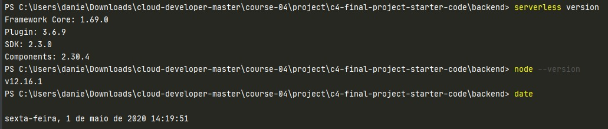

### Steps

#### Step 1 - Install and configure Serverless on your machine

1. Install the CLI framework following [this guide](https://www.serverless.com/framework/docs/getting-started/)
2. Login to your Serverless account like demonstrated below; it will ask to open your browser and finish the process.

```shell script
serverless login
```

#### Step 2 - Download the starter code, set your repo and update dependencies

1. Download the 
[starter code provided by Udacity](https://github.com/udacity/cloud-developer/tree/master/course-04/project/c4-final-project-starter-code)
2. Create a new GitHub repository and add the code following the new repo instructions. 
Alternatively, you can fork the starter code directly.
3. Run the commands described below to update both backend and frontend dependencies due to security 
warnings and push them to your repository.

> Update backend dependencies
```shell script
cd ./backend
npm update --save
npm audit fix
git add ./package.json ./package-lock.json
npm install serverless-offline serverless-dynamodb-local --save-dev
git commit -m "Update backend dependencies"
git push origin master
```

> Update frontend dependencies
```shell script
cd ./client
npm update --save
npm audit fix
git add ./package.json ./package-lock.json
git commit -m "Update frontend dependencies"
git push origin master
```

#### Step 3 - Acknowledge the necessary tasks and configuration in the backend side

The starter code comes with some `@TODO` flags, and it may contain errors like duplicated function handlers.

Give the `./backend/serverless.yml` a quick visual inspection and check for YAML warnings.

Check the `provider` key to make sure you are deploying in a region that makes sense to your account, and using the 
desired runtime version.

##### `provider` key example
> 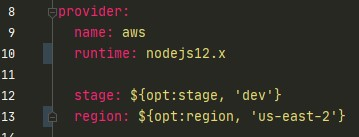

##### Resources
 * [Serverless provider documentation](https://www.serverless.com/framework/docs/providers/aws/guide/functions/)


#### Step 4 - Work in the backend @TODOs

This is pretty much the actual thinking job you have to do, this guide tries to abstract all setup and deployment phase 
rather than the code itself.

As long as the [requirements are addressed](https://review.udacity.com/#!/rubrics/2574/view), you have the freedom to 
solve the challenges with your own code style.

I will not detail in-depth this step, because it is covered by the project's instructions already. 

That being said, I will give my general thoughts and how I solved it, the code is in the repo but I don't suggest you to 
simply copy and use as-is. It is always up to you, in the end.

##### Starting the job

Well, we know for a fact that the `serverless.yml` file is the entry point of the project, so I started looking there. 
I could observe that the pre-built endpoints were referencing some helpers from the `src/lambda/http/` folder.


##### Preparing the structure

After analyzing the structure and the provided boilerplate, I focused in the separation of concerns aspect of the
 project, so if we have some exclusive `http` handlers, I knew that I had to provide the functionality from somewhere 
 else, just in case in the future I want to enable the same kind of processing, but now by `socket` instead of `http`.
 
 So I created a `/helpers` folder which then I created scripts to handle different layers like DB, bucket. 
 It is important to notice that you can solve this in different fashions, as long you implement the separation of
 concern strategy, you will be good to go.

A new request model had to be created under the `requests` folder as well to represent the `CreateSignedURLRequest` entity.


##### Creating AWS resources

Then I proceeded to add AWS resources like logging, dynamoDB and S3 bucket creation. On this step `cors` and `body validators` 
were also added.

PS: validators uses the scripts created in the `src/schemas` folder.


##### Importing the abstraction

Then in the `lambda/http/` declarations, I simply imported the layers created in the step before adding some conditional
checks to ensure a `fail-fast` approach would be in place.


#### Step 5 - Do a sanity-check deploy


The goal here is to simply deploy the starter code and make sure there is no error preventing the deployment.

From the `backend` folder run the command below.

> Start the serverless dashboard and give a name to it
```shell script
serverless
```

> Deploy the app and note the endpoint url in the end
```shell script
serverless deploy --verbose
```

You can check the logs from my deployment [here](./deploy.log)

##### Check the Serverless dashboard update
> 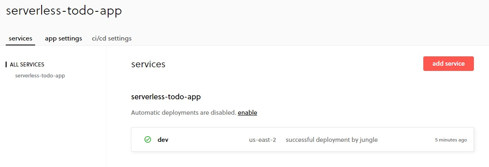

##### Check the AWS CloudFormation stack
> 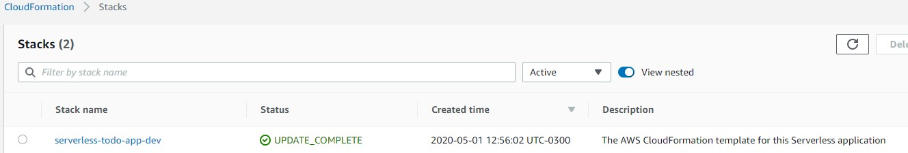

##### Check the endpoint (auth failure expected)
> 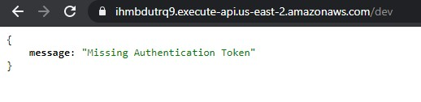


#### Step 6 - Create `Auth0` setup

In the Auth0 panel, you will create a new application from your dashboard. I created a `MACHINE TO MACHINE` type of app,
but I believe other types can work as well, but this is what I did.

I won't be explaining much about `Auth0`, I will just share my details here, you MUST setup the redirect and CORS options
otherwise this won't work as expected.

##### App basic info setup
> 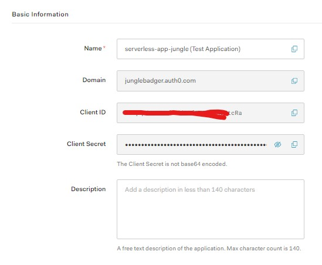

##### App props setup
> 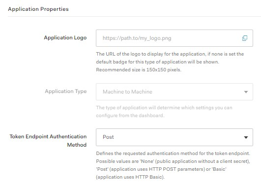

##### App URI setup
> 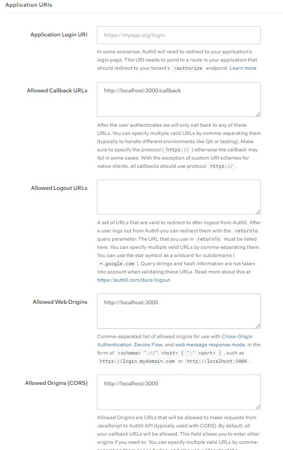


#### Step 7 - Configure the `Serverless` and `Auth0` info on frontend app

Now you just have to grab the information generated in the `Auth0` service and update the 

Make sure the region is configured with the same one you deployed your serverless app.

`apiId` will be the ID generated by the `serverless deploy` command
`domain` and `clientId`comes from `Auth0` app
`callbackUrl` is simply the localhost URL that the frontend app will be running under 


#### Step 8 - Test the login and endpoints from the frontend app

Enter the client folder, make sure the deps are installed and start the app

```shell script
cd client
npm install
npm start
```

##### Login page
> 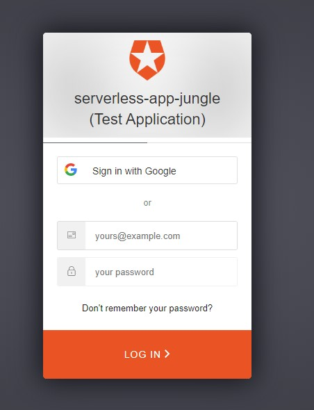

##### Functionalities
> 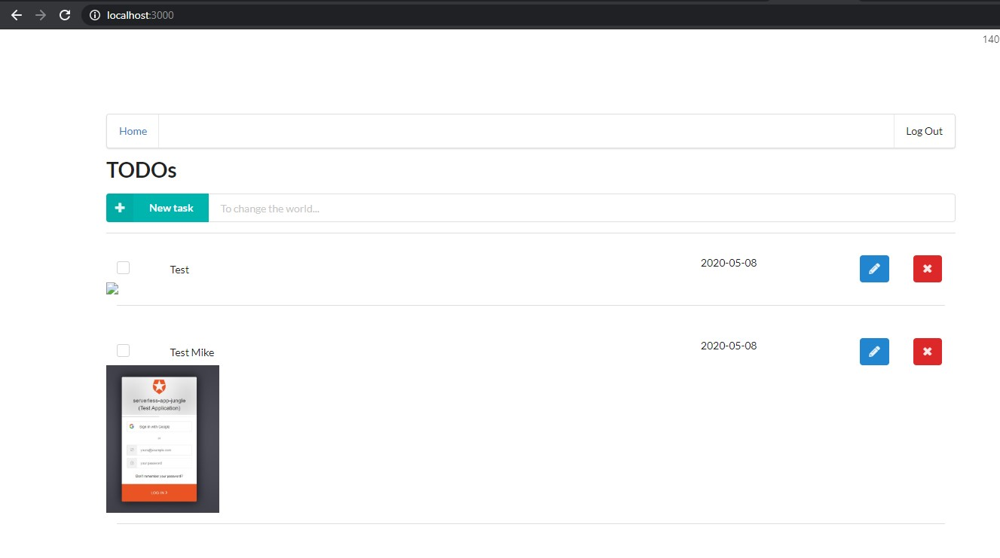

##### Service usage
> 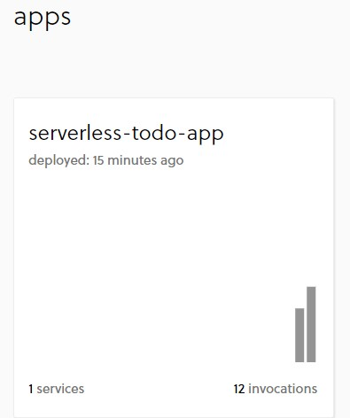


### Common issues to look out

1. Make sure the region is correct set both on your `backend/serverless.yml` and `client/src/config.ts` files
2. Make sure the `serverless deploy -v` don't emit any error
